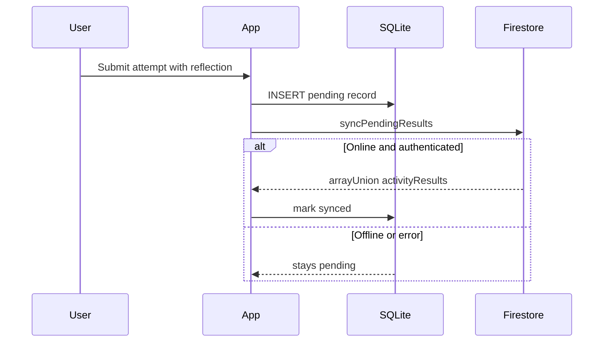

# STEMM Lab

Transform real-world physical activities into engaging, game-based Science, Technology, Engineering, Mathematics, and Medicine (STEMM) learning experiences for upper Primary and lower High School students.

Expo
React Native
TypeScript
Firebase

---

## Project Overview

STEMM Lab is a cross-platform mobile application built with Expo and React Native. Teams of students register a single shared account, complete seven sensor-driven STEMM challenges, and compete on a grade-aware leaderboard.

Each team account stores:

- Team name and member first names
- Grade level (Year 5–10)
- A unique 6-character alphanumeric **Team ID** (discriminator)
- Activity completion progress synced to Firebase Firestore

The app supports offline activity capture through a local SQLite queue and syncs results to the cloud when connectivity is restored. Activities use device sensors, camera, microphone, and location where appropriate.

**Primary user flow**

1. Sign up or log in as a team account
2. Browse and complete activities from the Activities tab
3. Track team progress on the Dashboard
4. Compare standings on the Leaderboard
5. Manage team profile, theme, and preferences in Settings

---

## Technology Stack


| Layer                     | Technology                                                |
| ------------------------- | --------------------------------------------------------- |
| Framework                 | Expo ~56 (managed workflow), React Native 0.85, React 19  |
| Language                  | TypeScript ~6.0                                           |
| Navigation                | Expo Router ~56 (file-based routing)                      |
| Authentication & Database | Firebase JS SDK 12 (Auth, Firestore)                      |
| Offline storage           | `expo-sqlite` (sync queue for activity results)           |
| Sensors & hardware        | `expo-sensors`, `expo-camera`, `expo-av`, `expo-location` |
| Background tasks          | `expo-background-fetch`, `expo-task-manager`              |
| UI & animation            | React Context (theme), Reanimated 4, Safe Area Context    |
| Icons                     | `expo-symbols` via cross-platform `AppIcon` wrapper       |
| Testing                   | Jest 29, `jest-expo`                                      |
| Linting                   | ESLint 9, `eslint-config-expo`                            |
| Build                     | EAS Build (`eas.json`)                                    |
| Dev tooling               | Firebase Admin SDK (standalone Firestore seed script)     |


The `/backend` folder contains shared service logic, models, and controllers used as a reference layer; the runnable Expo app lives in `/frontend`.

---

## Project Structure

```
StemmLab/
├── frontend/                    # Expo React Native application
│   ├── app/                     # Expo Router screens
│   │   ├── (auth)/              # Login & signup
│   │   ├── (tabs)/              # Main tab navigation
│   │   │   ├── dashboard.tsx
│   │   │   ├── activities.tsx
│   │   │   ├── leaderboard.tsx
│   │   │   └── settings.tsx     # Team profile + theme
│   │   └── activity/            # Individual challenge screens
│   ├── components/              # Reusable UI (ActivityLayout, themed components)
│   ├── config/                  # Firebase native initialization
│   ├── constants/               # Theme tokens, activity IDs
│   ├── hooks/                   # Theme, focus-load, activity styles
│   ├── services/                # Auth, groups, SQLite sync, activity logic
│   ├── utils/                   # Group discriminator generation
│   ├── scripts/                 # Standalone dev scripts (seed-database.mjs)
│   ├── __tests__/               # Jest unit tests
│   ├── app.config.js            # Expo config + env injection
│   ├── eas.json                 # EAS build profiles
│   └── package.json
├── backend/                     # Shared backend services & models
│   ├── config/
│   ├── controllers/
│   ├── models/
│   ├── services/
│   └── tasks/
├── firestore.rules              # Firestore security rules
└── README.md
```

---

## Getting Started

### Prerequisites

- Node.js 18+ and npm
- [Expo Go](https://expo.dev/go) on a physical device, or Android/iOS emulator
- A Firebase project with **Authentication (Email/Password)** and **Cloud Firestore** enabled

### 1. Clone and install

```bash
git clone <repository-url>
cd StemmLab/frontend
npm install
```

### 2. Configure Firebase environment variables

Create `frontend/.env` (this file is gitignored):

```env
EXPO_PUBLIC_FIREBASE_API_KEY=your-api-key
EXPO_PUBLIC_FIREBASE_AUTH_DOMAIN=your-project.firebaseapp.com
EXPO_PUBLIC_FIREBASE_PROJECT_ID=your-project-id
EXPO_PUBLIC_FIREBASE_STORAGE_BUCKET=your-project.appspot.com
EXPO_PUBLIC_FIREBASE_MESSAGING_SENDER_ID=your-sender-id
EXPO_PUBLIC_FIREBASE_APP_ID=your-app-id
```

Values are available in the Firebase Console under **Project settings → General → Your apps**.

### 3. Deploy Firestore security rules

From the repository root:

```bash
firebase deploy --only firestore:rules
```

### 4. Run the development server

```bash
cd frontend
npm start
```

Then press `a` for Android, `i` for iOS (macOS), `w` for web, or scan the QR code with Expo Go.

---

## Testing

Unit tests live in `frontend/__tests__/` and target services and shared logic.

```bash
cd frontend
npm test
```

Run a single test file:

```bash
npm test -- authService.grade.test.ts
```

Jest is configured in `frontend/jest.config.js` with the `jest-expo` preset. Coverage is collected from `services/` and `components/`.

```bash
npm run test:coverage
```

A full testing write-up for assessment (Jest + Firebase Test Lab + reflection) is in [`docs/TESTING_REPORT.md`](../docs/TESTING_REPORT.md).

Firebase Test Lab configs:

- [`frontend/firebase-test-lab.yml`](frontend/firebase-test-lab.yml) — instrumentation scaffold (Person A example)
- [`frontend/firebase-test-lab-robo.yml`](frontend/firebase-test-lab-robo.yml) — Robo test, Pixel 4 API 30 (Person B)

---

## Linting

```bash
cd frontend
npm run lint
```

ESLint uses the Expo flat config (`frontend/eslint.config.js`) with `eslint-config-expo`. Run lint before committing changes to catch unused variables, hook violations, and TypeScript-aware React Native issues.

---

## Key Features

### Team account authentication

- One Firebase Auth account per team (not per individual student)
- Registration captures team name, member first names, and grade level (Year 5–10)
- Creates linked `users/{uid}` and `groups/{groupId}` documents in a Firestore transaction

### Unique Team ID

- Each group receives a random 6-character alphanumeric discriminator (e.g. `ST3M9X`)
- Generated with Firestore collision checking at registration
- Displayed on the Settings screen for reference

### Seven STEMM activities

Each activity uses a three-tab layout (Overview, Activity, Submission):


| Activity                       | Category         |
| ------------------------------ | ---------------- |
| Parachute Drop Challenge       | Engineering      |
| Sound Pollution Hunter         | Engineering      |
| Hand Fan Challenge             | Engineering      |
| Earthquake-Resistant Structure | Engineering      |
| Human Performance Lab          | Health & Medical |
| Reaction Board Challenge       | Health & Medical |
| Breathing Pace Trainer         | Health & Medical |


### Leaderboard

- Teams ranked by completion percentage across all 7 challenges
- Tie-breaker: earlier `lastProgressUpdatedAt` wins
- Top-3 podium view plus scrollable standings
- Sticky bottom banner showing the current team's rank, name, and progress bar

### Offline sync

Activity submissions are saved locally first, then pushed to Firestore when online. See [Data storage](#data-storage) for the full flow.

### Theme support

- Light and dark mode toggle in Settings
- Theme tokens centralized in `constants/theme.ts` via `ThemeContext`

### Navigation

Main tabs: **Dashboard**, **Activities**, **Leaderboard**, **Settings**

Activity screens navigate back explicitly to the Activities list (not the Dashboard).

---

## Data storage

STEMM Lab uses a **two-tier storage model**: Firebase Firestore is the cloud source of truth for team data and shared progress, while **SQLite** on the device buffers activity submissions when the network is unavailable.

### Firebase (online)

| Service | Role |
| ------- | ---- |
| **Firebase Authentication** | Team login (one email/password per team). Session persisted on device via AsyncStorage. |
| **Cloud Firestore** | Stores team profiles, group documents, activity results, and leaderboard data. |

Key Firestore collections:

- **`users/{uid}`** — links an auth account to a `groupId`, plus team name, member names, and grade level.
- **`groups/{groupId}`** — team progress, member list, and an **`activityResults`** array containing every submitted attempt (sensor data, reflection, self-rating, GPS, timestamps).

The Dashboard, Leaderboard, and activity **Submission** tabs read from Firestore. Leaderboard rankings and completion percentages are derived from each group's `activityResults` and `completedActivitiesCount`.

### SQLite (offline queue)

On iOS and Android, the app uses **`expo-sqlite`** with a local database file `stemm_lab_offline.db`. A single table, **`offline_sync_queue`**, stores submissions waiting to reach Firestore:

| Column | Purpose |
| ------ | ------- |
| `payload` | JSON activity attempt (activity ID, attempt data, reflection, self-rating, etc.) |
| `status` | `pending`, `synced`, or `failed` |
| `latitude` / `longitude` | Optional GPS captured at submit time |
| `createdAt` / `updatedAt` | Timestamps for queue ordering and retries |

SQLite is **not** a full offline copy of the app database. It is a **sync queue** so teams can submit attempts without an immediate network connection.

On web, a lightweight in-memory fallback is used instead of SQLite (`sqliteService.web.ts`).

### How a submission flows



1. **Validate** — self-rating (1–5) and reflection text are checked.
2. **Queue locally** — `saveActivityAttempt()` writes a row to `offline_sync_queue` with status `pending` (`sqliteService.native.ts`).
3. **Sync immediately** — the app calls `syncPendingResults()` right after queuing.
4. **Push to Firestore** — for each pending record, the sync service loads the team's `groups/{groupId}` document and appends the attempt with `arrayUnion` on `activityResults`. If this is the team's first submission for that activity, `completedActivitiesCount` is incremented.
5. **Mark complete** — on success, the queue row is updated to `synced`; on failure, it stays `pending` (or is marked `failed` for invalid payloads).

Implementation lives in [`frontend/services/activityResultService.ts`](frontend/services/activityResultService.ts) and [`frontend/services/sqliteService.native.ts`](frontend/services/sqliteService.native.ts).

### When sync runs

Pending records are flushed to Firestore:

- **App launch** — `RootLayout` initializes the queue and calls `syncPendingResults()`.
- **After each submission** — attempted immediately when the user submits an attempt.
- **Dashboard / Leaderboard refresh** — pull-to-refresh triggers sync before reloading stats.
- **Background fetch** (optional) — `backgroundTaskService.ts` can run periodic sync when the app is backgrounded.

If a submission is made offline, it remains in SQLite until a later sync succeeds. Once synced, the attempt appears in the activity Submission tab and contributes to leaderboard progress.

### Design rationale

- **SQLite first** — guarantees the student gets confirmation that their work was saved on-device even without connectivity.
- **Firestore second** — centralizes team results so the leaderboard and multi-device access stay consistent.
- **Queue with retry** — failed or deferred uploads are not lost; they are retried on the next sync cycle instead of requiring the user to resubmit.

---

## Security

### Firestore rules (`firestore.rules`)


| Collection         | Policy                                                                                                                             |
| ------------------ | ---------------------------------------------------------------------------------------------------------------------------------- |
| `users/{userId}`   | Users can read/write only their own profile; creation validates team name, members, and grade                                      |
| `groups/{groupId}` | Authenticated read (leaderboard); create requires creator as first member or `isSeedData` flag; update restricted to group members |
| All other paths    | Denied by default                                                                                                                  |


### Client-side practices

- Firebase config loaded from environment variables (`EXPO_PUBLIC_`*), not hardcoded secrets
- Service account keys used only by the dev seed script and must never be committed (`.env` and key files are gitignored)
- Auth persistence uses AsyncStorage via `initializeAuth` on native platforms
- Grade-level validation enforced when joining groups

### Permissions

The app requests camera, microphone, and location permissions only for activities that need them. Usage descriptions are defined in `app.config.js`.

---

## Learn More

- [Expo Documentation](https://docs.expo.dev/)
- [Expo Router](https://docs.expo.dev/router/introduction/)
- [React Native](https://reactnative.dev/)
- [Firebase for Web/React Native](https://firebase.google.com/docs/web/setup)
- [Firestore Security Rules](https://firebase.google.com/docs/firestore/security/get-started)
- [EAS Build](https://docs.expo.dev/build/introduction/)
- [TypeScript Handbook](https://www.typescriptlang.org/docs/)

