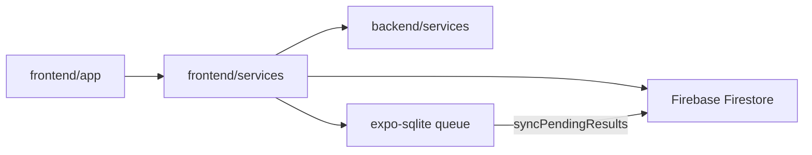

# STEMM Lab

Transform real-world physical activities into engaging, game-based Science, Technology, Engineering, Mathematics, and Medicine (STEMM) learning experiences for upper Primary and lower High School students.

Expo
React Native
TypeScript
Firebase

---

## Project Overview

STEMM Lab is a cross-platform mobile application built with Expo and React Native. Teams of students register a single shared account, complete seven sensor-driven STEMM challenges, and compete on a grade-aware leaderboard.

**Primary user flow**

1. Sign up or log in as a team account
2. Browse and complete activities from the Activities tab
3. Track team progress on the Dashboard
4. Compare standings on the Leaderboard
5. Manage team profile, theme, and preferences in Settings

The runnable Expo app lives in `/frontend`. The `/backend` folder contains shared service logic, models, and controllers used as a reference layer and for unit tests.

---

## Technology Stack


| Layer                     | Technology                                                                                   |
| ------------------------- | -------------------------------------------------------------------------------------------- |
| Framework                 | Expo ~56 (managed workflow), React Native 0.85, React 19                                     |
| Language                  | TypeScript ~6.0                                                                              |
| Navigation                | Expo Router ~56 (file-based routing)                                                         |
| Authentication & Database | Firebase JS SDK 12 (Auth, Firestore)                                                         |
| Offline storage           | `expo-sqlite` (sync queue for activity results)                                              |
| Sensors & hardware        | `expo-sensors`, `expo-camera`, `expo-audio`, `expo-location`, `expo-battery`, `expo-haptics` |
| Notifications             | `expo-notifications`                                                                         |
| Background tasks          | `expo-background-fetch`, `expo-task-manager`                                                 |
| Ads                       | `react-native-webview` (placeholder banner)                                                  |
| UI & animation            | React Context (theme), Reanimated 4, Safe Area Context                                       |
| Icons                     | `expo-symbols` via cross-platform `AppIcon` wrapper                                          |
| Testing                   | Jest 29, `jest-expo`                                                                         |
| Linting                   | ESLint 9, `eslint-config-expo`                                                               |
| Build                     | EAS Build (`eas.json`)                                                                       |


---

## Project Structure

```
StemmLab/
├── frontend/                    # Expo React Native application
│   ├── app/
│   │   ├── index.tsx            # Landing
│   │   ├── (auth)/              # login, signup
│   │   ├── (tabs)/              # dashboard, activities, leaderboard, settings
│   │   └── activity/            # 7 activities + attempt/[attemptId]
│   ├── components/
│   │   ├── activity/            # ActivityLayout, ReflectionModal, attempt-details/
│   │   └── ui/                  # AppButton, AppCard, etc.
│   ├── config/
│   │   └── firebaseNative.ts    # Firebase Auth + Firestore init
│   ├── constants/               # theme, activityCatalog, activities
│   ├── hooks/                   # useActivitySubmission, useActivityAttempts, etc.
│   ├── services/                # auth, sync, sensors, sqlite, ads, notifications, …
│   ├── types/
│   ├── utils/
│   ├── test-lab/
│   │   └── robo-login.json      # Firebase Test Lab Roboscript
│   ├── __tests__/
│   ├── app.config.js            # Expo config + env injection
│   ├── eas.json
│   └── package.json
├── backend/                     # Shared logic (mirrors many frontend services)
│   ├── config/
│   ├── controllers/
│   ├── models/
│   ├── services/
│   └── utils/                   # motionAnalysis, cooperativeScheduling, …
├── firestore.rules
├── TECHNICAL_IMPLEMENTATION.md  # Requirement-by-requirement technical reference
└── README.md
```

## Key Features

- **Team-based auth** — one Firebase account per team, shared across members
- **Seven STEMM activities** — Engineering: Parachute Drop, Sound Pollution, Hand Fan, Earthquake Structure; Health: Human Performance, Reaction Board, Breathing Trainer
- **Grade-aware leaderboard** — teams ranked by activities completed, filtered by grade level
- **Offline submit queue** — SQLite persistence with background and foreground sync
- **Reflection and self-rating** — every attempt includes written reflection and 1–5 self-rating
- **Light/dark theme** — toggle in Settings

---

## Architecture at a Glance

The Expo Router UI lives in `frontend/app/`. Shared business logic and models sit in `backend/` (mirrored by many frontend services and used in Jest tests). Firestore is the cloud source of truth; SQLite holds a pending sync queue when offline.




---

## Activity Implementation

All seven activities follow the same architecture: a **controller service** (`createXController(onUpdate)`) holds state and sensor subscriptions; the React screen renders state and calls controller methods; submission flows through `useActivitySubmission` → Reflection Modal → SQLite → Firestore.


| Activity                       | Category         | Key service / screen                                                                                                                                             |
| ------------------------------ | ---------------- | ---------------------------------------------------------------------------------------------------------------------------------------------------------------- |
| Parachute Drop Challenge       | Engineering      | `[parachuteDropService.ts](backend/services/parachuteDropService.ts)`, `[parachute-drop.tsx](frontend/app/activity/parachute-drop.tsx)`                          |
| Sound Pollution Hunter         | Engineering      | `[soundPollutionService.ts](frontend/services/soundPollutionService.ts)`, `[sound-pollution.tsx](frontend/app/activity/sound-pollution.tsx)`                     |
| Hand Fan Challenge             | Engineering      | `[handFanService.ts](backend/services/handFanService.ts)`, `[hand-fan.tsx](frontend/app/activity/hand-fan.tsx)`                                                  |
| Earthquake-Resistant Structure | Engineering      | `[earthquakeStructureService.ts](frontend/services/earthquakeStructureService.ts)`, `[earthquake-structure.tsx](frontend/app/activity/earthquake-structure.tsx)` |
| Human Performance Lab          | Health & Medical | `[humanPerformanceService.ts](backend/services/humanPerformanceService.ts)`, `[human-performance.tsx](frontend/app/activity/human-performance.tsx)`              |
| Reaction Board Challenge       | Health & Medical | `[reactionBoardService.ts](backend/services/reactionBoardService.ts)`, `[reaction-board.tsx](frontend/app/activity/reaction-board.tsx)`                          |
| Breathing Pace Trainer         | Health & Medical | `[breathingTrainerController.ts](backend/services/breathingTrainerController.ts)`, `[breathing-trainer.tsx](frontend/app/activity/breathing-trainer.tsx)`        |


### Parachute Drop Challenge

Teams enter drop height (m) and toy mass (kg), then run up to three prototype trials within an optional 20-minute design session timer. Each trial records fall time via a manual drop timer, optional landing video through `expo-camera`, and optional contact/bounce inputs. `[parachuteDropService.ts](backend/services/parachuteDropService.ts)` computes impact speed, acceleration, net force, drag force, and g-force. Submit payload: `{ dropHeightM, toyMassKg, sessionTimerSec, trials[] }`.

### Sound Pollution Hunter

Requires microphone and location permissions. Live dB metering polls `expo-audio` recorder metering every 100 ms and normalizes readings via `normalizeMeteringToDb()`. Each logged action saves label, measured dB, risk classification (`safe` through `severe`), and GPS coordinates. Submit payload: `{ actions[], zones[] }`.

### Hand Fan Challenge

Teams select material (paper or cardboard) and distance, record bend angle, and compute estimated force (N) from material stiffness presets. Up to three designs saved with label, prediction, and outcome. Submit payload: `{ designs[] }`.

### Earthquake-Resistant Structure

Up to three structural designs with label, folds, pillars, and prediction. A 10-second shake test runs accelerometer and gyroscope listeners at 100 ms alongside haptic pulses. Cumulative displacement (cm) and rotation (deg) measure stability. Submit payload: `{ designs[] }` with shake metrics.

### Human Performance Lab

Three movement phases (circle/figure-8, up/down, left/right) each use a countdown then accelerometer recording. Jerk events above a threshold decrement smoothness score and trigger haptic feedback. A live sparkline uses batched accelerometer updates (see [TECHNICAL_IMPLEMENTATION.md — Parallel Programming](TECHNICAL_IMPLEMENTATION.md#7-parallel-programming)). User taps Finish per phase. Submit payload: phase results with duration, smoothness, vibration events, and largest movement.

### Reaction Board Challenge

Loads team member names from Firestore for turn rotation. Three phases: dominant-hand tap reaction, non-dominant tap reaction, and 15-second finger tracing. Tap phases use random 1–3 s delay; reaction time in milliseconds. Tracing accuracy from finger-to-target distance. Teammates enter predictions before each member's turn. Submit payload: `{ phases[], memberTrials[] }` after all members complete all phases.

### Breathing Pace Trainer

Three conditions: rest, after jogging, after star jumps. Each phase: 3-second countdown, 30-second chest recording. Accelerometer Z-axis at 100 ms feeds Whittaker smoothing and peak detection; async analysis shows **Analyzing…** before results (see [TECHNICAL_IMPLEMENTATION.md — Parallel Programming](TECHNICAL_IMPLEMENTATION.md#7-parallel-programming)). Submit payload: `{ memberAttempts[] }` with per-phase metrics.

### Submission tab (all activities)

Shared `[ActivitySubmissionPanel.tsx](frontend/components/activity/ActivitySubmissionPanel.tsx)` shows a Discussion prompt from the activity catalog and a list of submitted attempts. Tapping an attempt opens Attempt Details with activity metadata, GPS link, activity-specific results via `[attemptResultRenderers.tsx](frontend/components/activity/attempt-details/attemptResultRenderers.tsx)`, and the team's reflection.

---

## Data Model


| Collection         | Purpose                                                                              |
| ------------------ | ------------------------------------------------------------------------------------ |
| `users/{uid}`      | Team name, member names, grade, email, link to group                                 |
| `groups/{groupId}` | Team metadata, `memberIds`, embedded `activityResults[]`, `completedActivitiesCount` |


Full schema, sync rules, and security policies are documented in [TECHNICAL_IMPLEMENTATION.md](TECHNICAL_IMPLEMENTATION.md).

---

## Testing

Unit tests live in `frontend/__tests__/` and target services and shared logic.

```bash
cd frontend
npm test
```

Run a single test file:

```bash
npm test -- authService.grade.test.ts
```

Jest is configured in `frontend/jest.config.js` with the `jest-expo` preset. Coverage is collected from `services/` and `components/`.

```bash
npm run test:coverage
```

**Firebase Test Lab:** `[frontend/test-lab/robo-login.json](frontend/test-lab/robo-login.json)` automates team login on a release APK. See [TECHNICAL_IMPLEMENTATION.md — Testing on devices](TECHNICAL_IMPLEMENTATION.md#14-testing-on-devices) for Roboscript details and `gcloud` command.

---

## Linting

```bash
cd frontend
npm run lint
```

ESLint uses the Expo flat config (`frontend/eslint.config.js`) with `eslint-config-expo`. Run lint before committing changes to catch unused variables, hook violations, and TypeScript-aware React Native issues.

---

## Learn More

- [Expo Documentation](https://docs.expo.dev/)
- [Expo Router](https://docs.expo.dev/router/introduction/)
- [React Native](https://reactnative.dev/)
- [Firebase for Web/React Native](https://firebase.google.com/docs/web/setup)
- [Firestore Security Rules](https://firebase.google.com/docs/firestore/security/get-started)
- [EAS Build](https://docs.expo.dev/build/introduction/)
- [TypeScript Handbook](https://www.typescriptlang.org/docs/)

