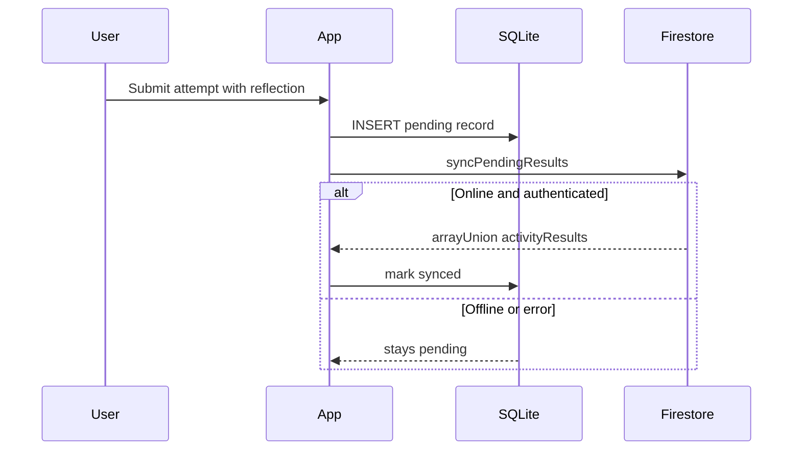

# STEMM Lab

Transform real-world physical activities into engaging, game-based Science, Technology, Engineering, Mathematics, and Medicine (STEMM) learning experiences for upper Primary and lower High School students.

Expo
React Native
TypeScript
Firebase

---

## Project Overview

STEMM Lab is a cross-platform mobile application built with Expo and React Native. Teams of students register a single shared account, complete seven sensor-driven STEMM challenges, and compete on a grade-aware leaderboard.

**Primary user flow**

1. Sign up or log in as a team account
2. Browse and complete activities from the Activities tab
3. Track team progress on the Dashboard
4. Compare standings on the Leaderboard
5. Manage team profile, theme, and preferences in Settings

The runnable Expo app lives in `/frontend`. The `/backend` folder contains shared service logic, models, and controllers used as a reference layer and for unit tests.

---

## Technology Stack

| Layer                     | Technology                                                                 |
| ------------------------- | -------------------------------------------------------------------------- |
| Framework                 | Expo ~56 (managed workflow), React Native 0.85, React 19                   |
| Language                  | TypeScript ~6.0                                                            |
| Navigation                | Expo Router ~56 (file-based routing)                                       |
| Authentication & Database | Firebase JS SDK 12 (Auth, Firestore)                                       |
| Offline storage           | `expo-sqlite` (sync queue for activity results)                            |
| Sensors & hardware        | `expo-sensors`, `expo-camera`, `expo-audio`, `expo-location`, `expo-battery`, `expo-haptics` |
| Notifications             | `expo-notifications`                                                       |
| Background tasks          | `expo-background-fetch`, `expo-task-manager`                               |
| Ads                       | `react-native-webview` (placeholder banner)                                |
| UI & animation            | React Context (theme), Reanimated 4, Safe Area Context                   |
| Icons                     | `expo-symbols` via cross-platform `AppIcon` wrapper                        |
| Testing                   | Jest 29, `jest-expo`                                                       |
| Linting                   | ESLint 9, `eslint-config-expo`                                             |
| Build                     | EAS Build (`eas.json`)                                                     |

---

## Project Structure

```
StemmLab/
├── frontend/                    # Expo React Native application
│   ├── app/
│   │   ├── index.tsx            # Landing
│   │   ├── (auth)/              # login, signup
│   │   ├── (tabs)/              # dashboard, activities, leaderboard, settings
│   │   └── activity/            # 7 activities + attempt/[attemptId]
│   ├── components/
│   │   ├── activity/            # ActivityLayout, ReflectionModal, attempt-details/
│   │   └── ui/                  # AppButton, AppCard, etc.
│   ├── config/
│   │   └── firebaseNative.ts    # Firebase Auth + Firestore init
│   ├── constants/               # theme, activityCatalog, activities
│   ├── hooks/                   # useActivitySubmission, useActivityAttempts, etc.
│   ├── services/                # auth, sync, sensors, sqlite, ads, notifications, …
│   ├── types/
│   ├── utils/
│   ├── test-lab/
│   │   └── robo-login.json      # Firebase Test Lab Roboscript
│   ├── __tests__/
│   ├── app.config.js            # Expo config + env injection
│   ├── eas.json
│   └── package.json
├── backend/                     # Shared logic (mirrors many frontend services)
│   ├── config/
│   ├── controllers/
│   ├── models/
│   ├── services/
│   └── tasks/
├── firestore.rules
└── README.md
```

---

## Technical Implementation

### Firebase Authentication

STEMM Lab uses one Firebase Auth email/password account per **team** (not per individual student). Registration in [`frontend/services/authService.ts`](frontend/services/authService.ts) calls `createUserWithEmailAndPassword`, then runs a Firestore transaction to create linked `users/{uid}` and `groups/{groupId}` documents atomically. Login in [`frontend/app/(auth)/login.tsx`](frontend/app/(auth)/login.tsx) uses `signInWithEmailAndPassword`, loads the team profile, and navigates to the Dashboard.

Session persistence on native platforms uses `initializeAuth` with `getReactNativePersistence(AsyncStorage)` in [`frontend/config/firebaseNative.ts`](frontend/config/firebaseNative.ts), so teams remain signed in across app restarts. Configuration is loaded from `EXPO_PUBLIC_FIREBASE_*` environment variables via [`frontend/app.config.js`](frontend/app.config.js). Dashboard and Leaderboard subscribe to `onAuthStateChanged` to reload stats when the session changes.

Each group receives a random 6-character alphanumeric **Team ID** (`teamDiscriminatorId`) at registration, generated with Firestore collision checking in [`frontend/utils/groupDiscriminator.ts`](frontend/utils/groupDiscriminator.ts) and displayed on the Settings screen.

### Cloud Firestore

Cloud Firestore is the authoritative cloud database for team profiles, activity results, and leaderboard rankings.

| Collection         | Purpose                                                                 |
| ------------------ | ----------------------------------------------------------------------- |
| `users/{uid}`      | Team name, member first names, grade level, email, link to `groupId`    |
| `groups/{groupId}` | Team metadata, `memberIds`, `activityResults[]`, `completedActivitiesCount`, join code |

Activity submissions append to `groups/{groupId}.activityResults` via `arrayUnion` in [`frontend/services/activityResultService.ts`](frontend/services/activityResultService.ts). Each attempt includes `activityId`, `attemptId`, `attemptNumber`, sensor payload, self-rating, reflection, GPS coordinates, and timestamps.

The **leaderboard** queries all groups ordered by `completedActivitiesCount` descending. Tie-breaker uses `lastProgressUpdatedAt`. The Leaderboard screen shows a top-3 podium, scrollable standings, and a sticky banner with the current team's rank and completion percentage.

Dashboard, Settings, and activity Submission tabs read from Firestore independently—there is no global profile store. Settings writes profile updates via `updateTeamProfile`, which updates both `users` and `groups` in a transaction.

### Firebase Test Lab

Automated device testing is supported via a Roboscript at [`frontend/test-lab/robo-login.json`](frontend/test-lab/robo-login.json). The script waits for the landing screen, taps **Log in**, fills test credentials using `testID` accessibility labels on the login form (`login-email`, `login-password`, `login-submit`), and taps **Sign in** so Robo can explore post-login screens. Run against a release APK via the Firebase Console or `gcloud firebase test android run` with the Roboscript attached.

### Device Sensors and GPS

Activities read device hardware through Expo modules. A shared throttle utility in [`frontend/utils/sensorThrottler.ts`](frontend/utils/sensorThrottler.ts) sets 100 ms sampling intervals during active recording.

| Capability    | Activities                                         | Implementation                                              |
| ------------- | -------------------------------------------------- | ----------------------------------------------------------- |
| Accelerometer | Hand Fan, Earthquake, Human Performance, Breathing | Motion intensity, displacement, jerk, chest Z-axis breaths |
| Gyroscope     | Earthquake Structure only                          | Cumulative rotation during shake test                       |
| Microphone    | Sound Pollution                                    | Live dB metering via `expo-audio`                           |
| Camera        | Parachute Drop                                     | Optional drop landing video (`expo-camera`)                 |
| Haptics       | Earthquake, Human Performance                      | Shake simulation and jerk feedback                          |
| GPS           | Sound Pollution (per action) + all submits         | `expo-location`                                             |
| Torch         | —                                                  | Not implemented                                             |

**GPS capture:** [`frontend/hooks/useActivitySubmission.ts`](frontend/hooks/useActivitySubmission.ts) auto-captures location when a team opens the Reflection Modal unless the activity already captured coordinates (Sound Pollution passes its session location explicitly). Sound Pollution also tags GPS on each logged noise action.

**Maps:** The app does not embed a MapView. Sound Pollution shows a text-based zone list of coordinates and dB levels. Attempt Details ([`frontend/components/activity/AttemptDetailsScreen.tsx`](frontend/components/activity/AttemptDetailsScreen.tsx)) shows a **Location Tagged** card that opens Google Maps externally via `expo-linking`.

Camera, microphone, and location permissions are requested only for activities that need them. Usage descriptions are defined in `app.config.js`.

### Navigation and Screen Data Flow

Expo Router file-based routes under [`frontend/app/`](frontend/app/) define the navigation structure:

```
Landing → Login/Signup → [Dashboard | Activities | Leaderboard | Settings]
                              ↓
                    Activity screen (Overview | Activity | Submission)
                              ↓
                    Attempt details (/activity/attempt/{attemptId})
```

All seven activities share [`ActivityLayout.tsx`](frontend/components/activity/ActivityLayout.tsx) with three tabs: **Overview** (catalog instructions), **Activity** (live experiment), and **Submission** (discussion + past attempts). Activity screens navigate back explicitly to the Activities list.

**Data between screens:**

- **Route params:** Only `attemptId` (+ optional `activityId`) when opening attempt details. The full attempt record is fetched from Firestore by ID, not passed as a serialized object.
- **Firestore:** Each screen fetches profile and group data independently via service calls.
- **SQLite:** Every submission writes to the local queue first, then syncs to Firestore.
- **AsyncStorage:** Used for Firebase Auth session persistence only—not activity data.

**Submit flow:** Activity tab → `useActivitySubmission.requestSubmit(data)` → GPS capture → Reflection Modal (self-rating 1–5 + written reflection) → `saveActivityAttempt()` → SQLite queue → Firestore sync → Submission tab refresh.

**Theme:** Light and dark mode toggle in Settings. Theme tokens live in `constants/theme.ts` via `ThemeContext`.

### Battery Monitoring

The Dashboard displays the device battery level and charging state using `expo-battery` in [`frontend/services/batteryService.ts`](frontend/services/batteryService.ts). Level and charging state are read concurrently via `Promise.all`. The badge appears in the Dashboard header. Battery data is display-only—the app does not throttle sensors or block submission based on charge level.

### Parallel Programming

Independent async operations run concurrently via `Promise.all` to reduce screen load time:

| Screen       | Parallel calls                                           |
| ------------ | -------------------------------------------------------- |
| Dashboard    | `fetchCurrentGroupStats()` + `fetchLeaderboardEntries()` |
| Leaderboard  | `fetchLeaderboardEntries()` + `fetchCurrentGroupStats()` |
| Settings     | `getUserProfile(uid)` + `fetchGroupForUser(uid)`         |
| Battery hook | `getBatteryLevelAsync()` + `getBatteryStateAsync()`      |

[`frontend/services/parallelProcessingService.ts`](frontend/services/parallelProcessingService.ts) provides `processInChunks()` and `runWithConcurrency()` for cooperative scheduling on the JavaScript thread—designed to keep the UI responsive when processing large sensor datasets.

### Background Tasks

[`frontend/services/backgroundTaskService.ts`](frontend/services/backgroundTaskService.ts) defines a background task `STEMM_LAB_BACKGROUND_SYNC` using `expo-task-manager` and `expo-background-fetch`. When triggered by the OS, it calls `syncPendingResults()` to push pending SQLite queue items to Firestore. `registerBackgroundSync()` registers the task with a 15-minute minimum interval and survives device reboot.

### Notifications

[`frontend/services/notificationService.ts`](frontend/services/notificationService.ts) uses `expo-notifications`. On app launch, [`frontend/app/_layout.tsx`](frontend/app/_layout.tsx) calls `registerForNotifications()` to request permission and create the Android notification channel `stemm-lab`. After a successful activity submission, [`frontend/hooks/useActivitySubmission.ts`](frontend/hooks/useActivitySubmission.ts) schedules a local notification ("Activity Submitted!") approximately one second later.

In Expo Go (SDK 53+), where native push is unavailable, the service falls back to `Alert.alert` with the same message. Full notification support requires a development build or release APK.

### Advertisements

[`frontend/services/adService.tsx`](frontend/services/adService.tsx) renders an `AdBannerView` on the Dashboard using a `react-native-webview` that loads static HTML styled as a sponsor placeholder ("STEMM Lab Sponsor"). This works in Expo Go without AdMob SDK setup. The banner is hidden on web. Native Google AdMob (`react-native-google-mobile-ads`) is not integrated; `useInterstitialAd()` is a stub for future use.

### SQLite Offline Storage

Before sending results to Firestore, every submission is saved locally in SQLite via `expo-sqlite` ([`frontend/services/sqliteService.native.ts`](frontend/services/sqliteService.native.ts)). Database file: `stemm_lab_offline.db`. Table: `offline_sync_queue`.

| Column                  | Purpose                         |
| ----------------------- | ------------------------------- |
| `payload`               | JSON-serialized attempt data    |
| `status`                | `pending`, `synced`, or `failed` |
| `latitude`, `longitude` | Optional GPS at queue time      |
| `createdAt`, `updatedAt` | Timestamps for ordering/retries |
| `dueTimestamp`          | Optional deferred sync          |

SQLite is a **sync queue**, not a full offline replica of Firestore. On web, an in-memory fallback in [`frontend/services/sqliteService.web.ts`](frontend/services/sqliteService.web.ts) provides the same API.

**Submission pipeline:**



1. **Validate** — self-rating (1–5) and reflection text are checked.
2. **Queue locally** — `saveActivityAttempt()` in [`frontend/services/activityResultService.ts`](frontend/services/activityResultService.ts) writes a row with status `pending`.
3. **Sync immediately** — `syncPendingResults()` runs right after queuing.
4. **Push to Firestore** — pending records append to `groups/{groupId}.activityResults` via `arrayUnion`. First submission per activity increments `completedActivitiesCount`.
5. **Mark complete** — success updates the queue row to `synced`; failure leaves it `pending` for retry.

Sync also runs on app launch (`RootLayout`), Dashboard/Leaderboard pull-to-refresh, and optionally via background fetch when registered.

### Firestore Security Rules

Rules in [`firestore.rules`](firestore.rules) enforce server-side authorization:

| Collection         | Policy                                                                                                                              |
| ------------------ | ----------------------------------------------------------------------------------------------------------------------------------- |
| `users/{userId}`   | Users read/write only their own profile; creation validates team name, members, and grade                                           |
| `groups/{groupId}` | Authenticated read (for leaderboard); create requires creator as first member or `isSeedData` flag; update restricted to group members |
| All other paths    | Denied by default                                                                                                                   |

Client-side practices: Firebase config loads from `EXPO_PUBLIC_*` environment variables (gitignored `.env`), not hardcoded secrets. Auth persistence uses AsyncStorage via `initializeAuth` on native platforms. Grade-level validation is enforced when joining groups.

Deploy rules from the repository root: `firebase deploy --only firestore:rules`

### Activity Implementation

All seven activities follow the same architecture: a **controller service** (`createXController(onUpdate)`) holds state and sensor subscriptions; the React screen renders state and calls controller methods; submission flows through `useActivitySubmission` → Reflection Modal → SQLite → Firestore.

| Activity                       | Category         | Key service / screen                                      |
| ------------------------------ | ---------------- | --------------------------------------------------------- |
| Parachute Drop Challenge       | Engineering      | `parachuteDropService.ts`, `parachute-drop.tsx`           |
| Sound Pollution Hunter         | Engineering      | `soundPollutionService.ts`, `sound-pollution.tsx`         |
| Hand Fan Challenge             | Engineering      | `handFanService.ts`, `hand-fan.tsx`                       |
| Earthquake-Resistant Structure | Engineering      | `earthquakeStructureService.ts`, `earthquake-structure.tsx` |
| Human Performance Lab          | Health & Medical | `humanPerformanceService.ts`, `human-performance.tsx`     |
| Reaction Board Challenge       | Health & Medical | `reactionBoardService.ts`, `reaction-board.tsx`           |
| Breathing Pace Trainer         | Health & Medical | `breathingTrainerController.ts`, `breathing-trainer.tsx`  |

#### Parachute Drop Challenge

Teams enter drop height (m) and toy mass (kg), then run up to three prototype trials within an optional 20-minute design session timer. Each trial records fall time via a manual drop timer, optional landing video through `expo-camera`, and optional contact/bounce inputs. A physics engine in `parachuteDropService.ts` computes impact speed, acceleration, net force, drag force, and g-force from height, mass, and timed measurements. Submit payload: `{ dropHeightM, toyMassKg, sessionTimerSec, trials[] }`.

#### Sound Pollution Hunter

Requires microphone and location permissions. Live dB metering polls `expo-audio` recorder metering every 100 ms and normalizes readings to a display range. Each logged action saves label, measured dB, risk classification (`safe` through `severe`), and GPS coordinates. Submit payload: `{ actions[], zones[] }`.

#### Hand Fan Challenge

Teams select material (paper or cardboard) and distance, then fan the phone while the accelerometer averages motion intensity. Bend angle and material stiffness produce an estimated force (N). Up to three designs are saved with label, prediction, and measured outcome. Submit payload: `{ designs[] }`.

#### Earthquake-Resistant Structure

Up to three structural designs are saved with label, folds, pillars, and prediction. A 10-second shake test runs accelerometer and gyroscope listeners at 100 ms alongside haptic pulses. Cumulative displacement (cm) and rotation (deg) measure structural stability. Submit payload: `{ designs[] }` with shake metrics.

#### Human Performance Lab

Three movement phases (circle/figure-8, up/down, left/right) each use a countdown then accelerometer recording at 100 ms. Jerk events above a threshold decrement a smoothness score and trigger haptic feedback. A live sparkline shows motion samples. User taps Finish per phase. Submit payload: three phase results with duration, smoothness, vibration events, and largest movement.

#### Reaction Board Challenge

Loads team member names from Firestore for turn rotation. Three phases: dominant-hand tap reaction, non-dominant tap reaction, and 15-second finger tracing. Tap phases use a random 1–3 s delay before the target appears; reaction time is measured in milliseconds. Tracing accuracy is computed from finger-to-target distance. Teammates enter predictions before each member's turn. Submit payload: `{ phases[], memberTrials[] }` after all members complete all phases.

#### Breathing Pace Trainer

Three conditions: breathing at rest, after jogging, after star jumps. Each phase uses a 3-second countdown then 30-second recording with the phone on the chest. Accelerometer Z-axis samples at 100 ms feed signal smoothing and peak detection to compute breath count and breaths per minute. Submit payload: `{ phases[] }` with metrics per condition.

**Submission tab (all activities):** Shared [`ActivitySubmissionPanel`](frontend/components/activity/ActivitySubmissionPanel.tsx) shows a Discussion prompt from the activity catalog and a list of submitted attempts. Tapping an attempt opens Attempt Details with activity metadata, GPS link, activity-specific results (via `attemptResultRenderers.tsx`), and the team's reflection.

---

## Testing

Unit tests live in `frontend/__tests__/` and target services and shared logic.

```bash
cd frontend
npm test
```

Run a single test file:

```bash
npm test -- authService.grade.test.ts
```

Jest is configured in `frontend/jest.config.js` with the `jest-expo` preset. Coverage is collected from `services/` and `components/`.

```bash
npm run test:coverage
```

**Firebase Test Lab:** [`frontend/test-lab/robo-login.json`](frontend/test-lab/robo-login.json) is a Roboscript that automates team login on a release APK. Upload the APK to Firebase Test Lab and attach the script for Robo exploration testing.

---

## Linting

```bash
cd frontend
npm run lint
```

ESLint uses the Expo flat config (`frontend/eslint.config.js`) with `eslint-config-expo`. Run lint before committing changes to catch unused variables, hook violations, and TypeScript-aware React Native issues.

---

## Learn More

- [Expo Documentation](https://docs.expo.dev/)
- [Expo Router](https://docs.expo.dev/router/introduction/)
- [React Native](https://reactnative.dev/)
- [Firebase for Web/React Native](https://firebase.google.com/docs/web/setup)
- [Firestore Security Rules](https://firebase.google.com/docs/firestore/security/get-started)
- [EAS Build](https://docs.expo.dev/build/introduction/)
- [TypeScript Handbook](https://www.typescriptlang.org/docs/)
