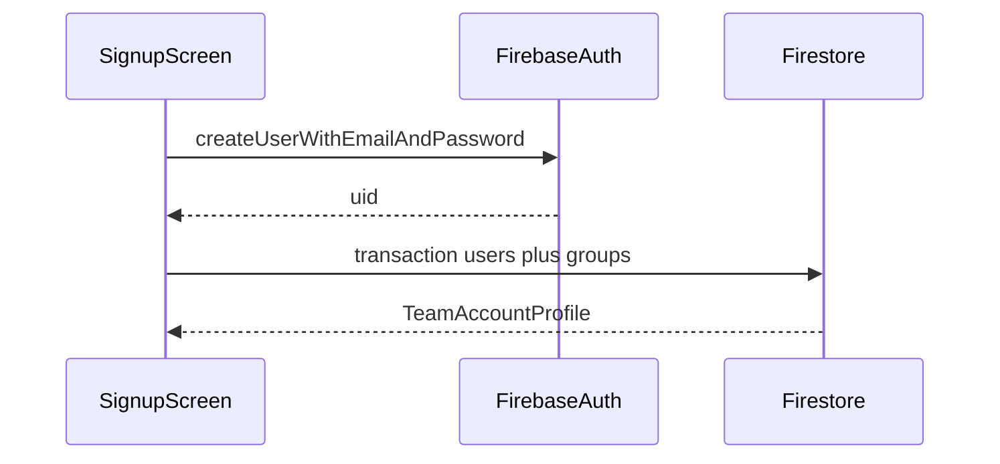
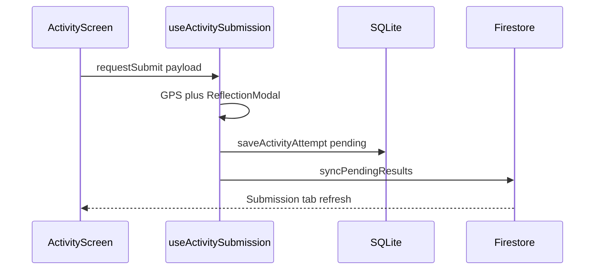
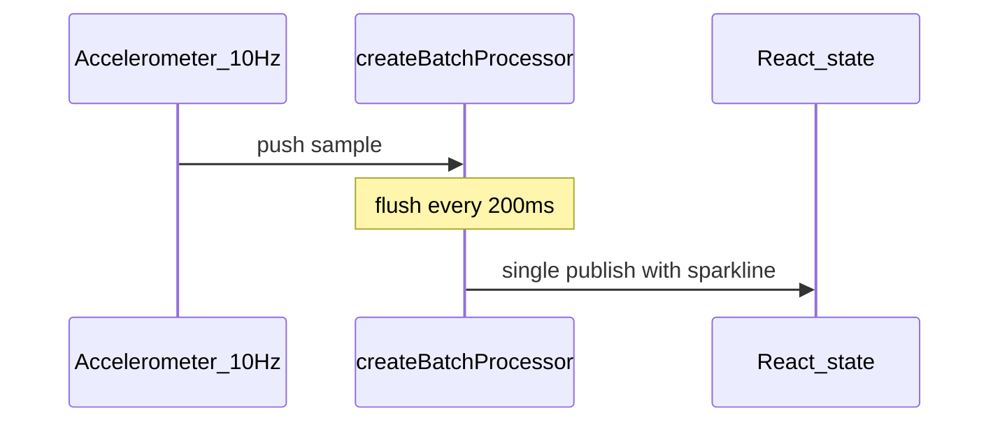
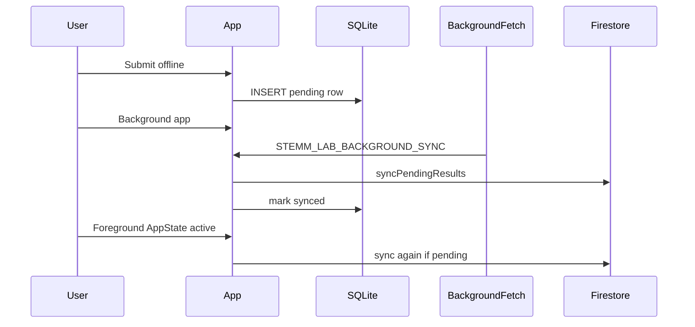
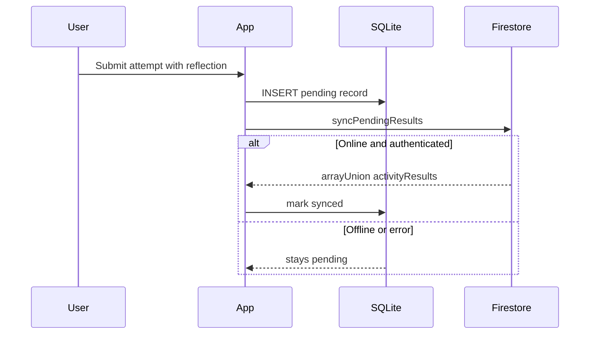

# STEMM Lab — Technical Implementation

This document explains how each major technical requirement is implemented in the STEMM Lab codebase: which files own the behavior, how data flows, and how native capabilities are wired on device versus in Expo Go.

---

## Requirements index


| Requirement                     | Section                                                                          | Primary files                                                                                                                                                                                    |
| ------------------------------- | -------------------------------------------------------------------------------- | ------------------------------------------------------------------------------------------------------------------------------------------------------------------------------------------------ |
| Firebase Authentication         | [§1](#1-firebase-authentication)                                                 | `[frontend/services/authService.ts](frontend/services/authService.ts)`, `[frontend/config/firebaseNative.ts](frontend/config/firebaseNative.ts)`, `[frontend/app/(auth)/](frontend/app/(auth)`/) |
| Cloud Firestore                 | [§2](#2-cloud-firestore)                                                         | `[frontend/services/activityResultService.ts](frontend/services/activityResultService.ts)`, `[frontend/services/groupService.ts](frontend/services/groupService.ts)`                             |
| Device sensors                  | [§4](#4-device-sensors-and-gps)                                                  | Activity controllers in `[backend/services/](backend/services/)`, `[frontend/utils/sensorThrottler.ts](frontend/utils/sensorThrottler.ts)`                                                       |
| GPS                             | [§4](#4-device-sensors-and-gps)                                                  | `[frontend/hooks/useActivitySubmission.ts](frontend/hooks/useActivitySubmission.ts)`, `[frontend/services/soundPollutionService.ts](frontend/services/soundPollutionService.ts)`                 |
| Navigation and data flow        | [§5](#5-navigation-and-screen-data-flow)                                         | `[frontend/app/](frontend/app/)`, `[frontend/components/activity/ActivityLayout.tsx](frontend/components/activity/ActivityLayout.tsx)`                                                           |
| Battery monitoring              | [§6](#6-battery-monitoring)                                                      | `[frontend/services/batteryService.ts](frontend/services/batteryService.ts)`, `[frontend/app/(tabs)/dashboard.tsx](frontend/app/(tabs)`/dashboard.tsx)                                           |
| Parallel programming            | [§7](#7-parallel-programming)                                                    | `[backend/utils/cooperativeScheduling.ts](backend/utils/cooperativeScheduling.ts)`, activity services                                                                                            |
| Background tasks (Task Manager) | [§8](#8-background-tasks-task-manager--work-manager)                             | `[frontend/services/backgroundTaskService.ts](frontend/services/backgroundTaskService.ts)`, `[frontend/app/_layout.tsx](frontend/app/_layout.tsx)`                                               |
| Notifications                   | [§9](#9-notifications)                                                           | `[frontend/services/notificationService.ts](frontend/services/notificationService.ts)`, `[frontend/hooks/useActivitySubmission.ts](frontend/hooks/useActivitySubmission.ts)`                     |
| Advertisements                  | [§10](#10-advertisements)                                                        | `[frontend/services/adService.tsx](frontend/services/adService.tsx)`                                                                                                                             |
| SQLite offline storage          | [§11](#11-sqlite-offline-storage)                                                | `[frontend/services/sqliteService.native.ts](frontend/services/sqliteService.native.ts)`, sync pipeline in `[activityResultService.ts](frontend/services/activityResultService.ts)`              |
| Firestore security rules        | [§12](#12-firestore-security-rules)                                              | `[firestore.rules](firestore.rules)`                                                                                                                                                             |
| Seven activities                | [§13](#13-activity-implementation) → [README](README.md#activity-implementation) | Per-activity services and `[frontend/app/activity/](frontend/app/activity/)` screens                                                                                                             |
| Device testing                  | [§14](#14-testing-on-devices)                                                    | `[frontend/test-lab/robo-login.json](frontend/test-lab/robo-login.json)`                                                                                                                         |


---

## 1. Firebase Authentication

### What it does

STEMM Lab uses one Firebase Auth **email/password account per team** (not per student). Registration creates a Firebase Auth user and atomically writes linked Firestore documents for the team profile and group. Login restores the session and loads the team profile for Dashboard and Settings.

### Why it matters

Classroom teams share a single device and one set of credentials. Atomic signup prevents orphaned Auth users without matching Firestore data. Session persistence avoids re-login every time the app restarts during a lab session.

### Key functions and components


| Name                                | File                                                                                         | Role                                                                            |
| ----------------------------------- | -------------------------------------------------------------------------------------------- | ------------------------------------------------------------------------------- |
| `registerUser()`                    | `[authService.ts](frontend/services/authService.ts)`                                         | `createUserWithEmailAndPassword` + Firestore transaction for `users` + `groups` |
| `loginUser()`                       | `[authService.ts](frontend/services/authService.ts)`                                         | `signInWithEmailAndPassword` + profile load                                     |
| `getUserProfile()`                  | `[authService.ts](frontend/services/authService.ts)`                                         | Reads `users/{uid}` for team name, members, grade, `groupId`                    |
| `updateTeamProfile()`               | `[authService.ts](frontend/services/authService.ts)`                                         | Transaction updating `users` and `groups`                                       |
| `initializeAuth()`                  | `[firebaseNative.ts](frontend/config/firebaseNative.ts)`                                     | Native persistence via `AsyncStorage`                                           |
| `createUniqueTeamDiscriminatorId()` | `[groupDiscriminator.ts](frontend/utils/groupDiscriminator.ts)`                              | 6-character Team ID with collision check                                        |
| Login / Signup screens              | `[login.tsx](frontend/app/(auth)`/login.tsx), `[signup.tsx](frontend/app/(auth)`/signup.tsx) | UI + navigation to tabs after auth                                              |


### How it works

1. **Signup** — User enters team name, member first names, grade, email, password. `registerUser()` creates Auth credentials, then runs a Firestore transaction: `users/{uid}` profile + new `groups/{groupId}` with the registering user as first member.
2. **Team ID** — A random `teamDiscriminatorId` is generated and checked against existing groups before commit.
3. **Login** — `loginUser()` signs in, fetches profile, returns `TeamAccountProfile` for screens to consume.
4. **Persistence** — On native platforms, `initializeAuth` uses `getReactNativePersistence(AsyncStorage)` so tokens survive app restarts.
5. **Config** — Firebase keys load from `EXPO_PUBLIC_FIREBASE_`* env vars injected via `[app.config.js](frontend/app.config.js)` (never committed in `.env`).
6. **Session listeners** — Dashboard and Leaderboard call `onAuthStateChanged` to reload stats when auth state changes.




### Expo Go vs release APK

Auth and Firestore work in Expo Go and release builds when `.env` is configured. No native module beyond AsyncStorage persistence is required for basic auth.

---

## 2. Cloud Firestore

### What it does

Firestore is the authoritative cloud store for team profiles, embedded activity results, completion counts, and leaderboard rankings. The app reads and writes through service modules; there is no global Redux-style store.

### Why it matters

Leaderboard and Submission tabs must reflect the same team progress across devices. Embedding `activityResults[]` on the group document keeps reads simple for classroom-scale data volumes.

### Key functions and components


| Name                        | File                                                                     | Role                                         |
| --------------------------- | ------------------------------------------------------------------------ | -------------------------------------------- |
| `saveActivityAttempt()`     | `[activityResultService.ts](frontend/services/activityResultService.ts)` | Validates, queues SQLite, triggers sync      |
| `syncPendingResults()`      | `[activityResultService.ts](frontend/services/activityResultService.ts)` | Uploads queue rows via `arrayUnion`          |
| `fetchLeaderboardEntries()` | `[activityResultService.ts](frontend/services/activityResultService.ts)` | Queries groups by `completedActivitiesCount` |
| `fetchCurrentGroupStats()`  | `[activityResultService.ts](frontend/services/activityResultService.ts)` | Current team progress for Dashboard          |
| `fetchActivityAttempts()`   | `[activityResultService.ts](frontend/services/activityResultService.ts)` | Submission tab history per activity          |
| `fetchGroupForUser()`       | `[groupService.ts](frontend/services/groupService.ts)`                   | Group metadata for Settings                  |


### Collections


| Collection         | Purpose                                                                                |
| ------------------ | -------------------------------------------------------------------------------------- |
| `users/{uid}`      | Team name, member first names, grade level, email, link to `groupId`                   |
| `groups/{groupId}` | Team metadata, `memberIds`, `activityResults[]`, `completedActivitiesCount`, join code |


### How it works

1. **Submit path** — Each attempt includes `activityId`, `attemptId`, `attemptNumber`, sensor payload, self-rating, reflection, GPS, and timestamps. `syncPendingResults()` appends to `groups/{groupId}.activityResults` with `arrayUnion`.
2. **Completion count** — First successful sync for a new `activityId` increments `completedActivitiesCount` and sets `lastProgressUpdatedAt`. Sync reads the group document **once** per batch and tracks a local `Set` of activity IDs to avoid redundant Firestore reads; writes stay **sequential** per group to prevent `arrayUnion` races.
3. **Leaderboard** — All groups ordered by `completedActivitiesCount` descending; tie-breaker is `lastProgressUpdatedAt`. UI shows top-3 podium, scrollable list, and sticky banner for the current team.
4. **Independent fetches** — Dashboard, Settings, and Submission tabs each call services directly—no shared profile cache.

---

## 4. Device Sensors and GPS

### What it does

Seven activities use Expo hardware modules for motion, audio, video, haptics, and location. A shared throttle utility sets 100 ms sensor intervals during active recording.

### Why it matters

STEMM Lab activities are physical experiments—the phone is the measurement instrument. Consistent sampling intervals make sparklines, displacement totals, and breath detection comparable across teams.

### Sensor capability matrix


| Capability    | Activities                                         | Implementation                                             |
| ------------- | -------------------------------------------------- | ---------------------------------------------------------- |
| Accelerometer | Hand Fan, Earthquake, Human Performance, Breathing | Motion intensity, displacement, jerk, chest Z-axis breaths |
| Gyroscope     | Earthquake Structure only                          | Cumulative rotation during shake test                      |
| Microphone    | Sound Pollution                                    | Live dB metering via `expo-audio`                          |
| Camera        | Parachute Drop                                     | Optional drop landing video (`expo-camera`)                |
| Haptics       | Earthquake, Human Performance                      | Shake simulation and jerk feedback                         |
| GPS           | Sound Pollution (per action) + all submits         | `expo-location`                                            |
| Torch         | —                                                  | Not implemented                                            |


### Key functions and components


| Name                                    | File                                                                               | Role                                               |
| --------------------------------------- | ---------------------------------------------------------------------------------- | -------------------------------------------------- |
| `applySensorThrottle()`                 | `[sensorThrottler.ts](frontend/utils/sensorThrottler.ts)`                          | Sets 100 ms / 1000 ms accelerometer/gyro intervals |
| `createEarthquakeStructureController()` | `[earthquakeStructureService.ts](frontend/services/earthquakeStructureService.ts)` | Accel + gyro listeners during shake test           |
| `createStretchLabController()`          | `[humanPerformanceService.ts](backend/services/humanPerformanceService.ts)`        | Accelerometer batching for movement phases         |
| `createBreathingTrainerController()`    | `[breathingTrainerController.ts](backend/services/breathingTrainerController.ts)`  | Z-axis sampling for breath detection               |
| `createSoundPollutionController()`      | `[soundPollutionService.ts](frontend/services/soundPollutionService.ts)`           | Microphone metering loop                           |
| Parachute camera                        | `[parachute-drop.tsx](frontend/app/activity/parachute-drop.tsx)`                   | `CameraView` slow-motion recording                 |


### Per-activity sensor usage


| Activity          | Sensors                           | Sampling / notes                                     |
| ----------------- | --------------------------------- | ---------------------------------------------------- |
| Parachute Drop    | Camera (optional)                 | Manual drop timer; video URI stored in trial         |
| Sound Pollution   | Microphone, GPS                   | Metering every 100 ms; GPS per logged action         |
| Hand Fan          | — (manual entry)                  | Force estimated from material stiffness + bend angle |
| Earthquake        | Accelerometer, gyroscope, haptics | 100 ms listeners; 10 s shake test                    |
| Human Performance | Accelerometer, haptics            | ~10 Hz batched to 200 ms UI updates                  |
| Reaction Board    | Touch only                        | Reaction time and tracing—no motion sensors          |
| Breathing Trainer | Accelerometer (Z)                 | 100 ms samples; 30 s recording per phase             |


### GPS


| Trigger                            | File                                                                                | Behavior                                                                             |
| ---------------------------------- | ----------------------------------------------------------------------------------- | ------------------------------------------------------------------------------------ |
| Reflection modal (most activities) | `[useActivitySubmission.ts](frontend/hooks/useActivitySubmission.ts)`               | Auto-captures location when modal opens unless activity already supplied coordinates |
| Sound Pollution actions            | `[soundPollutionService.ts](frontend/services/soundPollutionService.ts)`            | Tags each noise reading with session GPS                                             |
| Attempt details                    | `[AttemptDetailsScreen.tsx](frontend/components/activity/AttemptDetailsScreen.tsx)` | **Location Tagged** card opens Google Maps via `expo-linking`                        |


The app does not embed a MapView. Sound Pollution shows a text-based zone list of coordinates and dB levels.

### Permissions

Camera, microphone, and location permissions are declared in `[app.config.js](frontend/app.config.js)` with usage descriptions. Each activity requests permissions only when needed.

---

## 5. Navigation and Screen Data Flow

### What it does

Expo Router file-based routes define the app shell. All seven activities share a three-tab layout (Overview, Activity, Submission). Data passes between screens via route params, Firestore fetches, and the SQLite sync queue—not via a global activity store.

### Why it matters

Predictable navigation matches classroom use: land on Dashboard, pick an activity, submit, check Submission tab. Fetching attempt details by ID avoids passing large payloads through the router.

### Route structure

```
Landing → Login/Signup → [Dashboard | Activities | Leaderboard | Settings]
                              ↓
                    Activity screen (Overview | Activity | Submission)
                              ↓
                    Attempt details (/activity/attempt/{attemptId})
```

### Key components


| Component             | File                                                                    | Role                                                |
| --------------------- | ----------------------------------------------------------------------- | --------------------------------------------------- |
| Root tabs             | `[(tabs)/_layout.tsx](frontend/app/(tabs)`/_layout.tsx)                 | Bottom tab navigator with safe-area insets          |
| `ActivityLayout`      | `[ActivityLayout.tsx](frontend/components/activity/ActivityLayout.tsx)` | Shared three-tab activity shell                     |
| `ScreenContainer`     | `[screen-container.tsx](frontend/components/ui/screen-container.tsx)`   | Scroll + pull-to-refresh; reserves tab bar height   |
| `getBottomTabInset()` | `[safeArea.ts](frontend/utils/safeArea.ts)`                             | Tab bar clearance above Android 3-button navigation |


### Data between screens


| Mechanism    | Used for                                                                 |
| ------------ | ------------------------------------------------------------------------ |
| Route params | `attemptId` (+ optional `activityId`) on attempt details only            |
| Firestore    | Profile, group stats, leaderboard, submission history—fetched per screen |
| SQLite queue | Every submit writes locally first, then syncs                            |
| AsyncStorage | Firebase Auth session only—not activity data                             |


### Submit flow

Activity tab → `useActivitySubmission.requestSubmit(data)` → GPS capture → Reflection Modal (self-rating 1–5 + written reflection) → `saveActivityAttempt()` → SQLite queue → `syncPendingResults()` → Submission tab refresh.

### Theme

Light and dark mode toggle in Settings. Tokens live in `[constants/theme.ts](frontend/constants/theme.ts)` via `ThemeContext`.




---

## 6. Battery Monitoring

### What it does

The Dashboard shows current battery percentage and charging state using `expo-battery`. The hook subscribes to level and state change events after an initial parallel fetch.

### Why it matters

Field labs may run on shared tablets with varying charge. A visible badge helps teams notice low battery before a sensor-heavy activity—without blocking experiments programmatically.

### Key functions and components


| Name                 | File                                                       | Role                                                  |
| -------------------- | ---------------------------------------------------------- | ----------------------------------------------------- |
| `useBatteryStatus()` | `[batteryService.ts](frontend/services/batteryService.ts)` | Hook: level, `isCharging`, `displayLevel`, `isLoaded` |
| Dashboard badge      | `[dashboard.tsx](frontend/app/(tabs)`/dashboard.tsx)       | Renders battery icon + percentage in header           |


### How it works

1. On mount, `Promise.all([getBatteryLevelAsync(), getBatteryStateAsync()])` loads initial values.
2. Subscriptions update level and charging state when the OS reports changes.
3. Display is **informational only**—the app does not throttle sensors or block submission based on charge level.

---

## 7. Parallel Programming

React Native runs JavaScript on a **single main thread** (Hermes on mobile). There are no Web Workers on iOS/Android, so STEMM Lab uses **cooperative parallel patterns**—batching, concurrent I/O, and yielding to the event loop—rather than multi-core CPU threads.

### Concurrent I/O (`Promise.all`)

Independent async operations that do not depend on each other's results run together to reduce screen load time:


| Screen       | Parallel calls                                           |
| ------------ | -------------------------------------------------------- |
| Dashboard    | `fetchCurrentGroupStats()` + `fetchLeaderboardEntries()` |
| Leaderboard  | `fetchLeaderboardEntries()` + `fetchCurrentGroupStats()` |
| Settings     | `getUserProfile(uid)` + `fetchGroupForUser(uid)`         |
| Battery hook | `getBatteryLevelAsync()` + `getBatteryStateAsync()`      |


This is **concurrent waiting** on network/storage, not multi-core CPU parallelism.

### Cooperative scheduling (sensor and analysis workloads)

Core utilities live in `[backend/utils/cooperativeScheduling.ts](backend/utils/cooperativeScheduling.ts)` and are re-exported from `[frontend/services/parallelProcessingService.ts](frontend/services/parallelProcessingService.ts)`.


| Function                 | Purpose                                                            |
| ------------------------ | ------------------------------------------------------------------ |
| `createBatchProcessor()` | Buffer high-frequency events and flush on a timer (default 200 ms) |
| `yieldToEventLoop()`     | Pause between heavy loop iterations so the UI can render           |
| `processInChunks()`      | Process arrays in slices with a yield between chunks               |
| `runWithConcurrency()`   | Cap how many async tasks run at once                               |
| `measureAsync()`         | Profile async operation duration (dev/profiling)                   |


| Use case                         | Mechanism                                                                                                            | Key file / function                                                                                       |
| -------------------------------- | -------------------------------------------------------------------------------------------------------------------- | --------------------------------------------------------------------------------------------------------- |
| Human Performance accelerometer  | Samples ~10 Hz; listener `push()`es into batch processor; sparkline updates every **200 ms**                         | `[humanPerformanceService.ts](backend/services/humanPerformanceService.ts)` — `accelBatch`                |
| Breathing Trainer final analysis | ~300 Z-samples, Whittaker smoothing (6 iterations); `yieldToEventLoop()` between iterations; **Analyzing…** UI state | `[breathingTrainerLogic.ts](backend/services/breathingTrainerLogic.ts)` — `analyzeBreathingSignalAsync()` |
| Offline sync flush               | One Firestore `getDoc` before upload loop; local `Set` for activity IDs; sequential writes                           | `[activityResultService.ts](frontend/services/activityResultService.ts)` — `syncPendingResults()`         |





---

## 8. Background Tasks (Task Manager / Work Manager)

STEMM Lab uses `**expo-task-manager**` to define a background job and `**expo-background-fetch**` to let the OS wake the app periodically. On Android this maps to WorkManager-style deferred work; on iOS it uses background fetch with `UIBackgroundModes: ['fetch']` in `[frontend/app.config.js](frontend/app.config.js)`.

**Canonical implementation:** `[frontend/services/backgroundTaskService.ts](frontend/services/backgroundTaskService.ts)` (registered from `[frontend/app/_layout.tsx](frontend/app/_layout.tsx)`). Task name: `STEMM_LAB_BACKGROUND_SYNC`. An older unused stub at `backend/tasks/syncTaskManager.ts` was removed—it never wrote to Firestore.

### Why it matters

Teams often submit in gyms or outdoors without Wi‑Fi. Attempts are safe in SQLite, but Firestore (Submission tab, Leaderboard) only updates after `syncPendingResults()`. Background tasks and foreground sync reduce “my submission is not showing” without requiring a manual pull-to-refresh.

### Key functions


| Function                                          | File                       | Role                                                                   |
| ------------------------------------------------- | -------------------------- | ---------------------------------------------------------------------- |
| `TaskManager.defineTask(BACKGROUND_SYNC_TASK, …)` | `backgroundTaskService.ts` | Defines the handler the OS invokes                                     |
| `registerBackgroundSync()`                        | `backgroundTaskService.ts` | Registers with Background Fetch (~15 min minimum, `startOnBoot: true`) |
| `registerForegroundSyncListener()`                | `backgroundTaskService.ts` | `AppState` → `active` triggers sync                                    |
| `initializeBackgroundSync()`                      | `backgroundTaskService.ts` | Called from `_layout.tsx` after SQLite init                            |
| `syncPendingResults()`                            | `activityResultService.ts` | Reads due queue rows, pushes to Firestore                              |
| `getPendingSyncCount()`                           | `sqliteService.native.ts`  | Dashboard “uploads pending” badge                                      |
| `markRecordRetry()`                               | `sqliteService.native.ts`  | Re-queue failed sync with backoff                                      |


### Sync triggers


| Trigger                   | Behavior                                                                 |
| ------------------------- | ------------------------------------------------------------------------ |
| App launch                | `_layout.tsx` → `ensureSyncQueueInitialized()` → `syncPendingResults()`  |
| App foreground            | `AppState` → `active` → `syncPendingResults()`                           |
| OS background fetch       | Task `STEMM_LAB_BACKGROUND_SYNC` → sync; notification if attempts synced |
| Dashboard pull-to-refresh | Sync then reload stats                                                   |
| After submit              | `saveActivityAttempt()` queues row then syncs immediately                |





### Retry and user feedback

Failed sync attempts are re-queued as `pending` with backoff via `dueTimestamp` (30 s → 60 s → 120 s) using `markRecordRetry()`. The Dashboard shows a pending upload badge when `getPendingSyncCount() > 0`.

---

## 9. Notifications

### What it does

Local notifications confirm successful submissions and background sync. Permission is requested on launch; Android uses channel `stemm-lab`.

### Why it matters

Teams may background the app after submitting offline. A notification when sync completes confirms their attempt reached the cloud without checking the Submission tab.

### Key functions and components


| Name                          | File                                                                     | Role                                        |
| ----------------------------- | ------------------------------------------------------------------------ | ------------------------------------------- |
| `registerForNotifications()`  | `[notificationService.ts](frontend/services/notificationService.ts)`     | Permission + Android channel setup          |
| `scheduleLocalNotification()` | `[notificationService.ts](frontend/services/notificationService.ts)`     | Schedules titled local notification         |
| `isNotificationsAvailable()`  | `[notificationService.ts](frontend/services/notificationService.ts)`     | Detects native module presence              |
| Root layout call              | `[_layout.tsx](frontend/app/_layout.tsx)`                                | Requests permission on startup              |
| Post-submit notify            | `[useActivitySubmission.ts](frontend/hooks/useActivitySubmission.ts)`    | “Activity Submitted!” ~1 s after success    |
| Background sync notify        | `[backgroundTaskService.ts](frontend/services/backgroundTaskService.ts)` | Notifies when sync uploads pending attempts |


### Notification triggers


| Event                   | Message (typical)                | Mechanism                                        |
| ----------------------- | -------------------------------- | ------------------------------------------------ |
| App launch              | —                                | Request permission only                          |
| Activity submit success | Activity Submitted!              | `scheduleLocalNotification` from submission hook |
| Background sync success | N attempt(s) synced to the cloud | `scheduleLocalNotification` from task handler    |


### How it works

1. `_layout.tsx` calls `registerForNotifications()` on mount.
2. After successful Firestore sync from submission, the hook schedules a delayed local notification.
3. If `expo-notifications` is unavailable (Expo Go SDK 53+), the service falls back to `Alert.alert` with the same text.

---

## 10. Advertisements

### What it does

A sponsor placeholder banner appears on the Dashboard. It is implemented as a `WebView` loading static HTML—not live AdMob inventory.

### Key functions and components


| Name                  | File                                               | Role                                     |
| --------------------- | -------------------------------------------------- | ---------------------------------------- |
| `AdBannerView`        | `[adService.tsx](frontend/services/adService.tsx)` | Renders WebView banner on Dashboard      |
| `useInterstitialAd()` | `[adService.tsx](frontend/services/adService.tsx)` | Stub for future interstitial integration |


### How it works

1. Dashboard includes `<AdBannerView />` at the bottom of the scroll content.
2. WebView loads inline HTML styled as “STEMM Lab Sponsor”.
3. Component returns `null` on **web** so the banner does not appear in browser builds.
4. `**react-native-google-mobile-ads`** is not integrated.

---

## 11. SQLite Offline Storage

### What it does

Every submission is persisted locally in SQLite before Firestore upload. The queue survives app restarts and poor connectivity; sync drains the queue when online.

### Why it matters

Gym and outdoor labs often lose Wi‑Fi mid-session. Local persistence guarantees no lost attempts; background and foreground sync upload them later.

### Key functions and components


| Name                                                              | File                                                                     | Role                                         |
| ----------------------------------------------------------------- | ------------------------------------------------------------------------ | -------------------------------------------- |
| `initializeSyncQueue()`                                           | `[sqliteService.native.ts](frontend/services/sqliteService.native.ts)`   | Creates `offline_sync_queue` table           |
| `addSyncRecord()`                                                 | `sqliteService.native.ts`                                                | Inserts pending row                          |
| `getDueSyncRecords()`                                             | `sqliteService.native.ts`                                                | Rows ready to sync (respects `dueTimestamp`) |
| `markRecordSynced()` / `markRecordFailed()` / `markRecordRetry()` | `sqliteService.native.ts`                                                | Status transitions                           |
| `getPendingSyncCount()`                                           | `sqliteService.native.ts`                                                | Dashboard badge                              |
| `saveActivityAttempt()`                                           | `[activityResultService.ts](frontend/services/activityResultService.ts)` | Validates + queues + syncs                   |


### Schema (`stemm_lab_offline.db`)


| Column                   | Purpose                          |
| ------------------------ | -------------------------------- |
| `payload`                | JSON-serialized attempt data     |
| `status`                 | `pending`, `synced`, or `failed` |
| `latitude`, `longitude`  | Optional GPS at queue time       |
| `createdAt`, `updatedAt` | Timestamps for ordering/retries  |
| `dueTimestamp`           | Deferred sync / backoff          |


SQLite is a **sync queue**, not a full offline replica of Firestore. Web builds use an in-memory fallback in `[sqliteService.web.ts](frontend/services/sqliteService.web.ts)`.

### Submission pipeline




1. **Validate** — self-rating (1–5) and reflection text.
2. **Queue locally** — `saveActivityAttempt()` writes `pending` row.
3. **Sync immediately** — `syncPendingResults()` runs after queuing.
4. **Push to Firestore** — `arrayUnion` on `activityResults`; increment `completedActivitiesCount` for new activities.
5. **Mark complete** — success → `synced`; failure → `markRecordRetry()` with backoff (see [§8](#8-background-tasks-task-manager--work-manager)).

---

## 12. Firestore Security Rules

### What it does

Server-side rules in `[firestore.rules](firestore.rules)` enforce who can read and write each collection. Client code assumes rules are deployed; misconfiguration surfaces as permission-denied errors.

### Why it matters

Leaderboard reads all groups; writes must be limited to members. User profiles must not be editable by other teams.

### Policies


| Collection         | Policy                                                                                                                  |
| ------------------ | ----------------------------------------------------------------------------------------------------------------------- |
| `users/{userId}`   | Read/write own profile only; create validates team name, members, grade                                                 |
| `groups/{groupId}` | Authenticated read (leaderboard); create requires creator as first member or `isSeedData`; update restricted to members |
| All other paths    | Denied by default                                                                                                       |


### Client practices

- Firebase config from `EXPO_PUBLIC_`* environment variables (gitignored `.env`).
- Auth persistence via AsyncStorage on native.
- Grade-level validation when joining groups.

---

*For project setup, features overview, activity details, and architecture summary, see [README.md](README.md).*